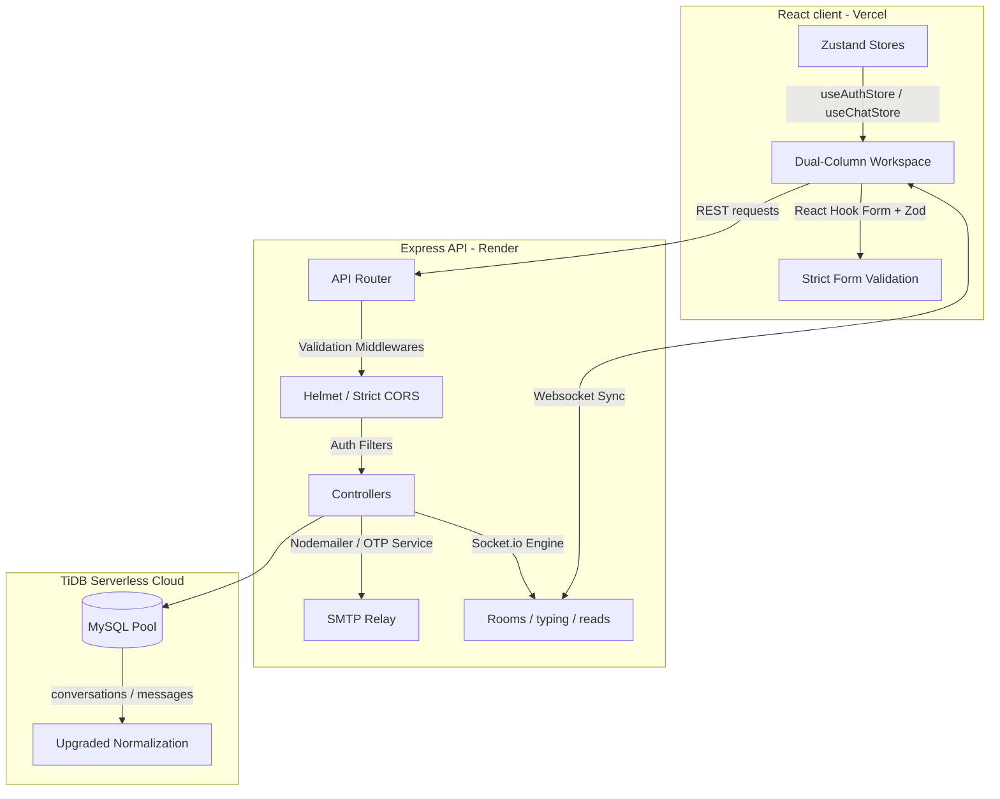

# HirePur — Intelligent Enterprise-Grade Job Portal 🚀

**HirePur** is a premium, secure, and highly scalable SaaS recruitment platform inspired by Wellfound and LinkedIn Jobs. Engineered with a React.js client and an Express.js backend API, it features structured multi-tier authentication, verified OTP gates, room-based Socket.io messaging, and real-time alerts.

---

## 🏗️ Architecture & Enhancements Overview



### 1. Advanced Gated Authentication & Session Persistence
* **OTP Gated Registration**: New users are marked unverified in the database until they verify their email with a 6-digit OTP code sent via Nodemailer.
* **Token Handshakes**: Access tokens are valid for 15 minutes, while secure refresh tokens are cached inside the `user_sessions` table with device details and exipry bounds (7 days).
* **Automatic Refreshing**: A custom Axios response interceptor intercepts expired tokens (401 status), invokes the `/refresh-token` endpoint in the background, updates state parameters, and retries the failed request seamlessly.

### 2. Normalized Real-time Chat (Socket.IO)
* **Performance Upgrades**: Switched from flat flat-file table logs to normalized tables (`conversations` and `messages`) with foreign key constraints and index lookups on `user_ids`.
* **Micro-interactivity**: Built-in listeners handle online status change notifications, debounced "... is typing" signals, auto-scroll, unread badge counters, and double-check read receipts (blue checkmarks for read, gray for sent).
* **Secure Channels**: The Socket handshake is protected by a custom JWT verification middleware. Connections are strictly restricted to role-based pipelines (*Employers can chat with candidates; Candidates can only chat with employers of jobs they applied to*).

### 3. Comprehensive Security Hardening
* **Rate Limiting**: Structured limiters throttle global API requests to 2000 per 15 minutes, and throttle OTP dispatches to 1 code per 60 seconds.
* **Helmet & CORS Policies**: Security filters intercept header exploits and only allow connections from authenticated client domains.
* **Secure Upload Filters**: Custom Multer handlers validate incoming file categories, restricting logo uploads to JPEG/PNG (under 2MB) and resume uploads to PDF/DOC/DOCX (under 5MB).

---

## 📂 Unified Folder Structure

```
hirepur/
├── backend/
│   ├── config/             # Connection configurations (db.js, cloudinary.js)
│   ├── controllers/        # Request controllers (auth, chat, notifications)
│   ├── database/           # Database migration and setup scripts
│   ├── middleware/         # Security validation and centralized error handlers
│   ├── models/             # Upgraded SQL queries (User, Chat, Job)
│   ├── routes/             # REST endpoints (auth, chat, upload, notifications)
│   ├── services/           # Decoupled utilities (otpService, emailService)
│   ├── uploads/            # Temporary disk storage for Multer
│   ├── .env.example        # Blueprint of environment parameters
│   └── server.js           # Server initializer & Socket.io hub
└── frontend/
    ├── src/
    │   ├── api/            # Axios API client interceptor layers
    │   ├── components/     # Reusable components (Navbar, ProtectedRoute)
    │   ├── pages/          # Interactive views (VerifyOtp, Chat, ResetPassword)
    │   └── store/          # Zustands state stores (useAuthStore, useChatStore)
    ├── vercel.json         # SPA routing rewrites rules
    └── .env.example        # API connection configs
```

---

## ⚙️ Development Environment Setup

### 1. Database Provisioning
Run the safe, automated migration script to provision the tables and migrate older historical data:
```bash
cd backend
npm run dev # (or node database/migrate-db.js)
```

### 2. Backend Environment Config (`backend/.env`)
Create a `.env` file inside the `backend` folder matching the `.env.example` blueprint:
```env
PORT=5000
NODE_ENV=production
CLIENT_URL=http://localhost:5173

DB_HOST=127.0.0.1
DB_USER=root
DB_PASS=yoursecurepassword
DB_NAME=hirepur

JWT_SECRET=supersecretjwtkey_hirepur_jobportal_2026
JWT_REFRESH_SECRET=supersecretrefreshkey_hirepur_jobportal_2026

SMTP_SERVICE=gmail
SMTP_USER=name@gmail.com
SMTP_PASS=appspecificpassword
```

### 3. Frontend Environment Config (`frontend/.env`)
Create a `.env` file inside the `frontend` folder:
```env
VITE_API_URL=http://localhost:5000/api
```

---

## 📋 Comprehensive Checklists

### 🔒 Security Hardening Audit
- [x] Strict CORS settings mapping explicitly to production domains.
- [x] Helmet activated to prevent header exploits.
- [x] 10KB JSON body limit to thwart payload volume attacks.
- [x] Input parameters sanitized to prevent XSS and SQL injection.
- [x] Gated file filters validating mime-types and size boundaries.
- [x] Brute-force throttling gating OTP validations (5 failed trials max).
- [x] Refresh tokens stored securely in DB and validated before access.

### 🧪 API & Real-time Sync Checklist
- [x] **Registration Verification**: Submitting forms sends OTP email, returns a verification redirect code, and blocks login until activated.
- [x] **Password Recovery**: Recovery code sent via SMTP enables secure password creation, validating the Zod strength policy.
- [x] **Socket Handshakes**: Sockets verify token and refuse connection if invalid.
- [x] **Typing Updates**: typing is active: visual dots animate; typing stops: dots vanish.
- [x] **Read Receipts**: Opening chat histories or receiving active messages marks the conversation read and switches checks to blue.

---

## 🚀 Production Deployment Guidelines

### 1. Database Setup → TiDB Cloud Serverless
1. Sign up on **TiDB Cloud** and spawn a serverless MySQL instance.
2. Under the Connection settings, retrieve the Connection String and enable **SSL support**.
3. In your production `.env`, configure:
   ```env
   DB_HOST=your-tidb-endpoint.tidbcloud.com
   DB_USER=your-user.root
   DB_PASS=your-secure-password
   DB_NAME=hirepur
   ```

### 2. Backend Deployment → Render
1. Create a Web Service on **Render** and link your GitHub repository.
2. Set Environment to `Node`.
3. Set the **Build Command** to: `npm install`
4. Set the **Start Command** to: `node database/migrate-db.js && node server.js` (this ensures migrations run automatically on every build!).
5. Add all keys from your `.env` to the Render Environment Variables tab.

### 3. Frontend Deployment → Vercel
1. Create a Project on **Vercel** and connect your frontend folder.
2. Select the **Vite** framework preset.
3. Configure the **Build Command** to: `npm run build`
4. Configure the **Output Directory** to: `dist`
5. Under Environment Variables, add: `VITE_API_URL=https://your-backend.onrender.com/api`
6. Deploy! Vercel will build the SPA and use the `vercel.json` rewrites rules to handle client router paths safely.
